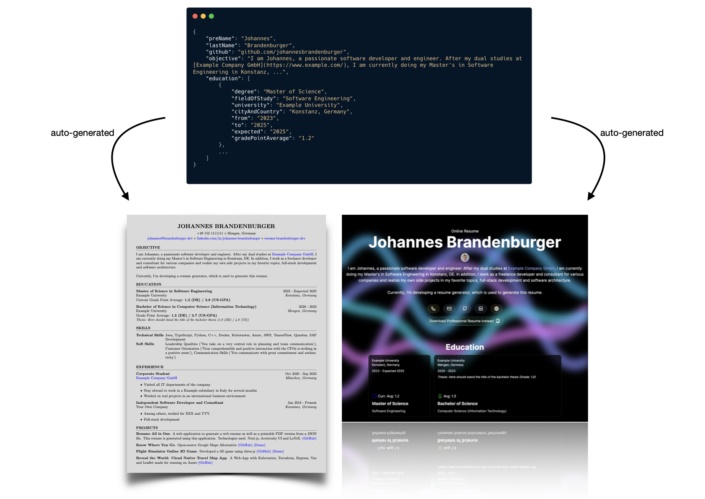

# Resume - All in One

This is a resume generator for professionals.
Define your resume data in a JSON file and generate all kinds of formats out of it.

Currently supported:

- Professional PDF resume derived from "faangpath" resume template
- Web resume on the basis of Next.js, React, Tailwind CSS and Aceternity UI

## Usage

1. Clone the repository
2. Start the watcher with:
   1. `docker build . -t "resume-watcher"; docker run -v $(pwd):/home -p 3000:3000 resume-watcher`
3. Open `http://localhost:3000` in your browser to see the web resume
4. View `out/pdf-professional/main.pdf` to see the PDF resume (also available via button on the web resume)
5. Edit `data.json` to change the resume data
6. The resumes will be automatically updated

### Generate static web resume

If you don't want to use the generated Next.js project to deploy your web resume, you can generate a static html project with: `cd out/web/ && npm run export` and deploy the `out/web/out` folder.